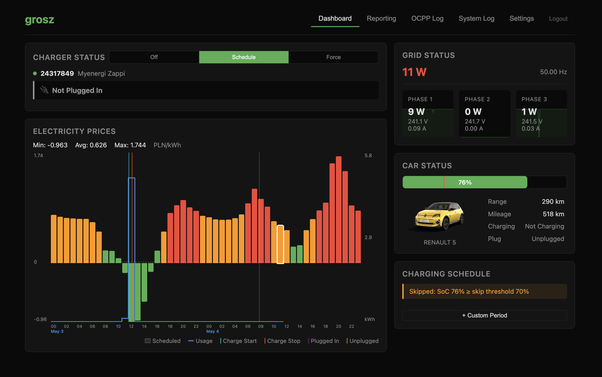

# grosz

> Cost-aware home EV charging companion for Renault EVs, MyEnergi Zappi2, and the Pstryk.pl dynamic tariff.

<p align="center">
  
</p>

## What it does

grosz glues together three things that don't natively talk to each other:

- **Pstryk.pl**: a Polish dynamic-tariff provider. grosz pulls hour-by-hour electricity prices for today and tomorrow.
- **MyEnergi Zappi2**: your home EV charger. grosz drives it as an OCPP 1.6J central system, setting the charging profile, starting and stopping sessions, and reading meter values.
- **Renault EV (MyRenault / Kamereon)**: optional. grosz polls your car's State of Charge, range, and plug status so it knows when (and how much) to charge.

Once an hour grosz takes all of that and schedules charging into the cheapest hourly slots that will still hit your target SoC by your deadline. It then pushes a `TxDefaultProfile` to the Zappi over OCPP. The schedule shows up overlaid on the price chart, you can override it with a forced-charge window, and every decision is logged so you can later check why it did or didn't charge.

## Why two public vhosts

grosz exposes two listeners, so you need a public DNS name for each:

| Vhost | Default port | Protocol | Who connects |
|---|---|---|---|
| `grosz.example.com` | `:3000` | HTTPS + SSE | You (browser) |
| `ocpp.example.com` | `:8887` | WebSocket (OCPP 1.6J) | MyEnergi cloud, on behalf of your Zappi |

**Both must be reachable from the public internet.** The Zappi does not connect to your LAN. Instead it hands its OCPP backend URI off to MyEnergi's cloud, and MyEnergi opens the WebSocket to that URI from their own datacentre. A LAN-only or VPN-only endpoint will never get a connection. From [MyEnergi support](https://support.myenergi.com/hc/en-gb/articles/16864772981137-Setting-up-Open-Charge-Point-Protocol-OCPP):

> The OCPP service is hosted in the cloud and is accessible over the internet. For security reasons, it is not possible to set an internal IP address as the backend URI for a locally hosted OCPP platform. Customers who wish to use OCPP with a platform hosted within their internal network must provide an externally facing IP address.

Splitting the UI and the OCPP endpoint onto separate hostnames keeps the protocols clean (HTTP/SSE on one, long-lived WebSocket on the other), lets you firewall the OCPP vhost tightly (its only legitimate client is MyEnergi's egress), and makes certbot easy.

## Features

- Cheapest-hour scheduling against the Pstryk dynamic tariff, refreshed each hour
- Forced-charge windows that bypass the optimiser when you need to leave early
- Live SoC, range, and plug status from MyRenault / Kamereon
- Zappi quirks handled for you: commercial-mode reset, single `TxDefaultProfile`, virtual ID tags, meter-interval setup
- Per-session cost reporting and historical session history
- Live OCPP and system event logs in the UI
- Optional WebAuthn login on top of username and password
- Single static binary, embedded React UI, SQLite persistence, no external runtime

## Quick start (local development)

Requirements: Go 1.22+, Node 20+, npm.

```bash
make build      # builds the React UI and the Go binary
./grosz         # runs on :3000 (Web UI) and :8887 (OCPP)
```

For hot-reload during development:

```bash
make dev        # runs Go server + Vite dev server side by side
```

Open <http://localhost:3000> and log in with the default `admin` / `admin`. Configure tariff, charger, and (optional) Renault credentials in **Settings**. All runtime configuration lives in SQLite, so there is no env file to maintain.

## Deploying on Debian (production)

Tested on Debian 13. Assumes nginx and grosz live on the same host. If they don't, replace `127.0.0.1` in the upstreams with the grosz host's IP and firewall accordingly. Replace `example.com` with your own domain throughout.

### 1. DNS

Point two A/AAAA records at the public IP of your server:

- `grosz.example.com` for the Web UI
- `ocpp.example.com` for the OCPP endpoint MyEnergi will reach

Both must resolve publicly.

### 2. Install the .deb

Grab the latest release from the GitHub Releases page:

```bash
curl -LO https://github.com/consi/grosz/releases/latest/download/grosz_<version>_linux_amd64.deb
sudo dpkg -i grosz_<version>_linux_amd64.deb
```

The package:

- Installs the binary to `/usr/bin/grosz`
- Creates a `grosz` system user
- Stores SQLite at `/var/lib/grosz/grosz.db`
- Drops a systemd unit at `/lib/systemd/system/grosz.service` and starts it

Verify:

```bash
sudo systemctl status grosz
curl -I http://127.0.0.1:3000
```

### 3. nginx vhosts

Install nginx, then drop these three files in place.

`/etc/nginx/conf.d/proxy-maps.conf`, shared map blocks used by both vhosts:

```nginx
map $remote_addr $proxy_forwarded_elem {
    ~^[0-9.]+$        "for=$remote_addr";
    ~^[0-9A-Fa-f:.]+$ "for=\"[$remote_addr]\"";
    default            "for=unknown";
}

map $http_forwarded $proxy_add_forwarded {
    "~^(,[ \\t]*)*([!#$%&'*+.^_`|~0-9A-Za-z-]+=([!#$%&'*+.^_`|~0-9A-Za-z-]+|\"([\\t \\x21\\x23-\\x5B\\x5D-\\x7E\\x80-\\xFF]|\\\\[\\t \\x21-\\x7E\\x80-\\xFF])*\"))?(;([!#$%&'*+.^_`|~0-9A-Za-z-]+=([!#$%&'*+.^_`|~0-9A-Za-z-]+|\"([\\t \\x21\\x23-\\x5B\\x5D-\\x7E\\x80-\\xFF]|\\\\[\\t \\x21-\\x7E\\x80-\\xFF])*\"))?)*([ \\t]*,([ \\t]*([!#$%&'*+.^_`|~0-9A-Za-z-]+=([!#$%&'*+.^_`|~0-9A-Za-z-]+|\"([\\t \\x21\\x23-\\x5B\\x5D-\\x7E\\x80-\\xFF]|\\\\[\\t \\x21-\\x7E\\x80-\\xFF])*\"))?(;([!#$%&'*+.^_`|~0-9A-Za-z-]+=([!#$%&'*+.^_`|~0-9A-Za-z-]+|\"([\\t \\x21\\x23-\\x5B\\x5D-\\x7E\\x80-\\xFF]|\\\\[\\t \\x21-\\x7E\\x80-\\xFF])*\"))?)*)?)*$" "$http_forwarded, $proxy_forwarded_elem";
    default "$proxy_forwarded_elem";
}

map $http_upgrade $connection_upgrade {
    default upgrade;
    ''      close;
}
```

`/etc/nginx/sites-available/grosz`, the Web UI vhost:

```nginx
upstream grosz_api {
    server 127.0.0.1:3000;
    keepalive 32;
}

server {
    listen 80;
    listen [::]:80;
    server_name grosz.example.com;
    return 301 https://$host$request_uri;
}

server {
    listen 443 ssl;
    listen [::]:443 ssl;
    http2 on;
    server_name grosz.example.com;

    # filled in by certbot in step 4
    ssl_certificate     /etc/letsencrypt/live/grosz.example.com/fullchain.pem;
    ssl_certificate_key /etc/letsencrypt/live/grosz.example.com/privkey.pem;
    ssl_session_timeout 1d;
    ssl_session_cache   shared:SSL:10m;
    ssl_session_tickets off;
    ssl_protocols TLSv1.2 TLSv1.3;

    client_max_body_size 10m;

    proxy_http_version 1.1;
    proxy_buffering    off;
    proxy_cache        off;
    proxy_read_timeout 24h;          # SSE streams
    proxy_set_header Host              $host;
    proxy_set_header X-Real-IP         $remote_addr;
    proxy_set_header X-Forwarded-For   $proxy_add_x_forwarded_for;
    proxy_set_header X-Forwarded-Proto $scheme;
    proxy_set_header Forwarded         $proxy_add_forwarded;

    location / {
        proxy_set_header Upgrade    $http_upgrade;
        proxy_set_header Connection $connection_upgrade;
        proxy_pass http://grosz_api;
    }
}
```

`/etc/nginx/sites-available/grosz-ocpp`, the OCPP vhost (long-lived WebSocket):

```nginx
upstream grosz_ocpp {
    server 127.0.0.1:8887;
    keepalive 32;
}

server {
    listen 80;
    listen [::]:80;
    server_name ocpp.example.com;
    return 301 https://$host$request_uri;
}

server {
    listen 443 ssl;
    listen [::]:443 ssl;
    http2 on;
    server_name ocpp.example.com;

    ssl_certificate     /etc/letsencrypt/live/ocpp.example.com/fullchain.pem;
    ssl_certificate_key /etc/letsencrypt/live/ocpp.example.com/privkey.pem;
    ssl_session_timeout 1d;
    ssl_session_cache   shared:SSL:10m;
    ssl_session_tickets off;
    ssl_protocols TLSv1.2 TLSv1.3;

    location / {
        proxy_pass http://grosz_ocpp;
        proxy_http_version 1.1;
        proxy_set_header Upgrade           $http_upgrade;
        proxy_set_header Connection        $connection_upgrade;
        proxy_set_header Host              $host;
        proxy_set_header X-Real-IP         $remote_addr;
        proxy_set_header X-Forwarded-For   $proxy_add_x_forwarded_for;
        proxy_set_header X-Forwarded-Proto $scheme;
        proxy_set_header Forwarded         $proxy_add_forwarded;
        proxy_read_timeout    604800s;     # 7d, OCPP keeps this open
        proxy_send_timeout    604800s;
        proxy_connect_timeout 10s;
        proxy_buffering off;
        proxy_cache off;
    }
}
```

Enable and test:

```bash
sudo ln -s /etc/nginx/sites-available/grosz       /etc/nginx/sites-enabled/
sudo ln -s /etc/nginx/sites-available/grosz-ocpp  /etc/nginx/sites-enabled/
sudo nginx -t
sudo systemctl reload nginx
```

### 4. TLS with Let's Encrypt

```bash
sudo apt install certbot python3-certbot-nginx
sudo certbot --nginx -d grosz.example.com -d ocpp.example.com
```

certbot picks up the two server blocks above, drops the certs into `/etc/letsencrypt/live/...`, and rewrites the vhosts. Renewal runs automatically via the `certbot.timer` systemd unit.

### 5. Point Zappi at your OCPP URL

In the myenergi app, open your Zappi → **OCPP**:

- **Backend URI:** `wss://ocpp.example.com/`
- **ChargePoint ID:** your Zappi's serial number
- **Authorisation Key:** any value, but set the same one in the grosz UI under Settings → OCPP

The Zappi will connect (via MyEnergi's cloud) within a minute or two. You should see a `BootNotification` show up in **OCPP Log** in the grosz UI. See [MyEnergi's OCPP setup guide](https://support.myenergi.com/hc/en-gb/articles/16864772981137-Setting-up-Open-Charge-Point-Protocol-OCPP) for screenshots.

### 6. First-run UI configuration

Visit `https://grosz.example.com` and log in with the default `admin` / `admin`. In **Settings**:

1. Change the admin password (and optionally register a WebAuthn key)
2. Enter your Pstryk.pl API token
3. (Optional) Enter MyRenault credentials for SoC integration
4. Set the OCPP authorisation key to match what you configured on the Zappi
5. Set scheduler parameters: target SoC, deadline, maximum charge power, skip threshold

That's it. grosz pulls the next price window and schedules the cheapest hours automatically.

## Architecture

- **OCPP 1.6J** central system on `:8887`, built on [`lorenzodonini/ocpp-go`](https://github.com/lorenzodonini/ocpp-go). The Zappi connects via the MyEnergi cloud OCPP proxy.
- **Web UI** on `:3000`. React + Vite SPA, embedded into the Go binary via `go:embed`. SSE for live updates.
- **Persistence**: pure-Go SQLite (`modernc.org/sqlite`, no CGO) for settings, OCPP events, sessions, tariff cache.
- **Tariff**: Pstryk.pl REST API. Prices cached locally; the scheduler picks the cheapest hours that satisfy the charge target.
- **Vehicle SoC (optional)**: MyRenault / Kamereon API, polled to drive charge-target awareness.

A pre-built container image is also published at `ghcr.io/consi/grosz` if you'd rather containerise.

## Acknowledgements

- [`lorenzodonini/ocpp-go`](https://github.com/lorenzodonini/ocpp-go) for the OCPP 1.6 protocol library.
- [`python-renault-api`](https://github.com/hacf-fr/renault-api) and the broader Renault open-source community for documenting the Gigya/Kamereon authentication flow used by `internal/vehicle/renault.go`.

## License

grosz is **source-available** under the [Elastic License 2.0](LICENSE), not OSI-approved open source. In short:

- ✅ Self-hosting, modification, and redistribution are permitted.
- ✅ Contributions are welcome and accepted under the same license.
- ❌ Providing grosz to third parties as a hosted or managed service that exposes a substantial set of its features is **not** permitted.

Full text and FAQ: <https://www.elastic.co/licensing/elastic-license>.
